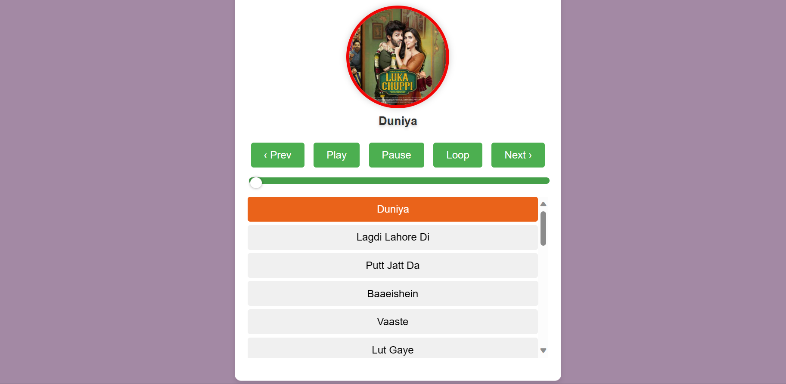

# Songify



[](https://opensource.org/licenses/MIT)

## Description

Songify is a clean, minimalistic music player built with vanilla HTML, CSS, and JavaScript — no frameworks, no build step (icons come from [Bootstrap Icons](https://icons.getbootstrap.com/) via CDN). It supports a multi-language song library (Hindi, English, Punjabi, Bhojpuri, Maithili) with search, language filtering, shuffle, loop, volume control, dark/light theme, keyboard shortcuts, and OS-level media controls (Media Session API).

---
## Demo

You can see a live demo of Songify [here](https://amazingashish.github.io/Songify/).

---
## Features

- Play, pause, next, previous, shuffle, and loop
- Search songs by title or artist
- Filter the library by language (All / Hindi / English / Punjabi / Bhojpuri / Maithili)
- Seekable progress bar with live elapsed/total time
- Volume control, persisted across visits
- Dark and light theme, persisted across visits
- Keyboard shortcuts: `Space` play/pause, `←`/`→` previous/next
- OS-level media controls (lock screen / notification) via the Media Session API
- Fully responsive, single-column layout on mobile

---
## Adding songs to the library

Songify ships with a starter library. To add your own tracks legally:

1. Drop the mp3 and a square cover image into `media/` (any filename works, e.g. `media/my-song.mp3` and `media/my-song.jpg`).
2. Open `songs.js` and add an entry to the `SONGS` array:

   ```js
   { title: "Song Name", artist: "Artist Name", language: "hindi", audioSrc: "media/my-song.mp3", imageSrc: "media/my-song.jpg" },
   ```

3. `language` must be one of: `hindi`, `english`, `punjabi`, `bhojpuri`, `maithili`. To support another language, add it to `LANGUAGE_LABELS` in `songs.js` too — the filter chips update automatically.

Only add audio you own or are licensed to use — the player itself places no restriction on file count or language.

### Included royalty-free tracks

The `english` category includes twelve instrumental tracks by Kevin MacLeod (incompetech.com), licensed under [Creative Commons: By Attribution 4.0](https://creativecommons.org/licenses/by/4.0/): Carefree, Wallpaper, Life of Riley, Monkeys Spinning Monkeys, Bass Walker, Local Forecast - Elevator, Gymnopedie No. 1, Deliberate Thought, Ossuary 6 - Air, News Theme, Sneaky Snitch, and Fluffing a Duck. Keep this attribution if you redistribute the project.

Authentic vocal tracks in Hindi, Punjabi, Bhojpuri, and Maithili are commercially licensed music and are **not** included — add your own legally obtained files following the steps above.

---
## Installation

1. Clone the repository: `git clone https://github.com/AmazingAshish/Songify.git`
2. Open `index.html` in your browser, or serve the folder with any static file server.

---
## Usage

- Click a song in the library to play it, or use the transport controls.
- Use the search box or language chips to narrow the library.
- Click the sun/moon icon to switch theme.

---
## Contribution

Contributions are welcome! Feel free to open a pull request or create an issue for any bug fixes, improvements, or new features you'd like to add.

## License

This project is licensed under the [MIT License](https://opensource.org/licenses/MIT).
